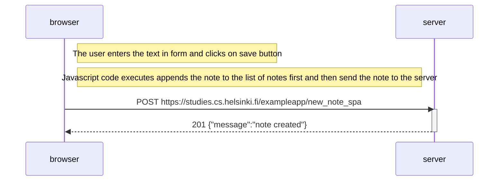

```mermaid
sequenceDiagram
    participant browser
    participant server

    Note right of browser: The user enters the text in form and clicks on save button

    Note right of browser: Javascript code executes appends the note to the list of notes first and then send the note to the server

    browser->>server: POST https://studies.cs.helsinki.fi/exampleapp/new_note_spa
    activate server
    server-->>browser: 201 {"message":"note created"}
    deactivate server
    
```